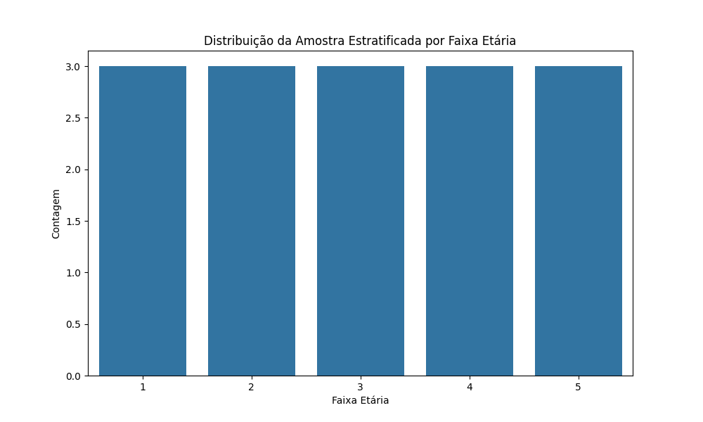

EXERCÍCIO (casa): Selecione uma amostra casual simples, uma amostra sistemática e uma amostra estratificada (por faixa etária) de tamanho n=15 da população de tamanho N=90 funcionários da Empresa Alimentícia XPTO usando o software BioEstat. Em seguida,crie uma pasta PARA CADA TIPO DE AMOSTRAGEM contendo os dados dos funcionários sorteados.

➔ Planilha do Excel (arquivo tabulação_empresa XPTO. xls)

Quantidade de pessoas de cada faixa etária na amostra estratificada:

